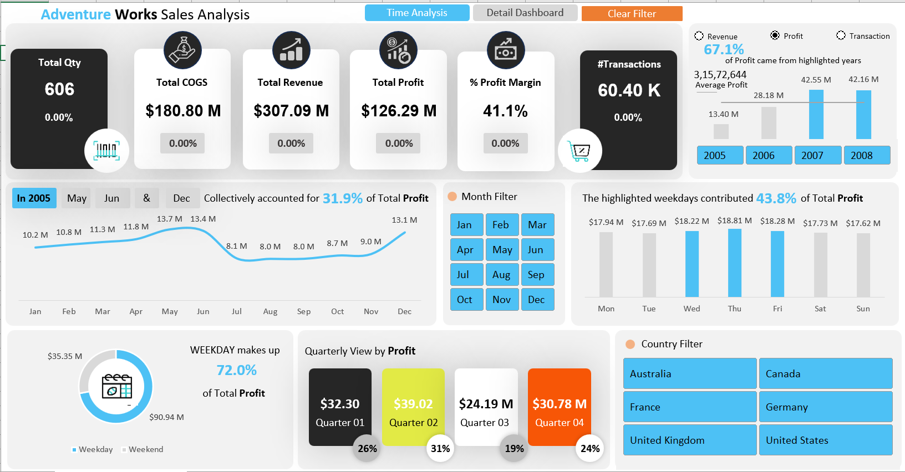
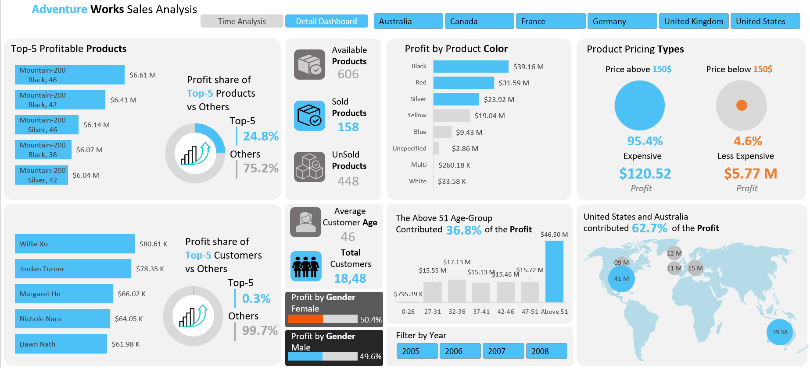

# AdventureWorks Sales & Business Performance Dashboard





## 📊 Project Overview

This project is an interactive **Sales & Business Performance Dashboard developed in Microsoft Excel** using the AdventureWorks Internet Sales dataset.

The dashboard was designed to transform raw transactional data into meaningful business insights across **sales performance, profitability, products, customers, geography, and time**.

The project demonstrates an end-to-end analytics workflow using **Power Query for data preparation, Excel Data Model for data modeling, PivotTables/PivotCharts for analysis and visualization, Excel formulas for analytical calculations, and VBA for dashboard automation**.

---

## 🎯 Business Objective

The primary objective of the dashboard is to provide a centralized and interactive view of business performance and help users answer questions such as:

* How are revenue and profit performing over time?
* How does the current year's performance compare with the previous year?
* Which products generate the highest profit?
* Which customers contribute the most to overall profitability?
* Which months and days of the week perform best?
* How does profitability vary by product characteristics such as colour?
* Which customer age groups contribute the most profit?
* How is business performance distributed across different countries?
* What percentage of total profit is contributed by top-performing products and customers?

---

## 📁 Dataset

The dashboard uses an **AdventureWorks-style Internet Sales dataset** containing transactional sales information along with supporting customer, product, geography, date, and sales territory dimensions.

The data is structured using a fact-and-dimension approach.

### Main Fact Table

* `FactInternetSales`

### Dimension Tables

* `DimCustomer`
* `DimDate`
* `DimGeography`
* `DimProduct`
* `DimSalesTerritory`

An additional `All Measures` component is used to support the analytical calculations within the Excel Data Model.

### Key Data Attributes

The dataset contains information related to:

* Sales transactions
* Customers
* Products
* Product colours
* Dates
* Countries / geography
* Sales territories
* Revenue
* Cost of goods sold
* Profit
* Order quantity

The dataset covers the period from **2005 to 2008**.

---

## 📌 Key Business Metrics

The dashboard tracks several important KPIs, including:

| KPI            |   Value |
| -------------- | ------: |
| Revenue        | ~307.1M |
| Profit         | ~126.3M |
| COGS           | ~180.8M |
| Profit Margin  |  ~41.1% |
| Transactions   |  ~60.4K |
| Order Quantity | ~631.9K |
| Customers      |  ~18.5K |
| Products       |     606 |

These KPIs provide a high-level overview of business performance while allowing users to drill down into specific dimensions.

---

# 🛠️ Tools & Technologies

### Microsoft Excel

The dashboard makes extensive use of Excel's analytical and visualization capabilities, including:

* PivotTables
* PivotCharts
* Slicers
* Excel formulas
* Conditional formatting
* Data Model
* VBA / Macros

### Power Query

Power Query is used as the primary **data preparation and transformation layer**.

The workbook contains queries for:

```text
FactInternetSales
DimCustomer
DimDate
DimGeography
DimProduct
DimSalesTerritory
All Measures
```

Power Query provides a repeatable process for preparing the data before it is used for analysis and reporting.

### Excel Data Model

The fact and dimension tables are incorporated into the **Excel Data Model**, allowing the dashboard to work with a structured analytical model rather than relying solely on a single flat dataset.

This enables the creation of relationships between different business dimensions and supports analysis through PivotTables and measures.

### VBA / Macros

The workbook is saved in `.xlsm` format and contains VBA automation.

A `ClearFilter` macro is implemented to simplify the process of clearing dashboard filters and returning the analysis to an unfiltered state.

---

# 🔄 Data Preparation & Analysis Workflow

The overall workflow of the project is:

```text
Raw AdventureWorks Data
          │
          ▼
     Power Query
          │
          ▼
Data Cleaning & Transformation
          │
          ▼
 Fact & Dimension Tables
          │
          ▼
    Excel Data Model
          │
          ▼
 Measures & Calculations
          │
          ▼
 PivotTables / PivotCharts
          │
          ▼
 Interactive Dashboards
          │
          ▼
 Slicers & VBA Automation
```

This approach separates **data preparation, data modeling, analysis, and visualization**, making the dashboard easier to maintain and refresh.

---

# 📈 Dashboard Analysis

## 1. Overall Sales Performance

The main analysis provides a high-level view of business performance through KPIs and visualizations covering:

* Revenue
* Profit
* COGS
* Profit Margin
* Transactions
* Order Quantity
* Yearly performance
* Year-over-year performance

The dashboard also provides comparisons between selected years and previous years to identify changes in business performance.

---

## 2. Time-Based Analysis

The dashboard provides detailed analysis of business performance across time.

### Yearly Analysis

Year-over-year analysis is used to identify:

* Revenue growth
* Profit growth
* Changes in profitability
* Changes in transaction volume
* Performance relative to previous years

### Monthly Analysis

Monthly profitability is analyzed to identify:

* Highest-performing months
* Lowest-performing months
* Monthly contribution to overall profit
* Changes in performance throughout the year

### Day-of-Week Analysis

Profitability is also analyzed by day of the week to identify patterns in business performance from Monday through Sunday.

---

## 3. Product Analysis

The Product Analysis section focuses on product-level profitability.

The analysis includes:

* Product profitability ranking
* Top 5 most profitable products
* Contribution of top products to total profit
* Comparison of top products against remaining products
* Profitability by product colour

This allows users to identify products that have the greatest impact on overall business profitability.

---

## 4. Customer Analysis

The Customer Analysis section focuses on customer-level profitability and customer demographics.

It includes:

* Customer profitability ranking
* Top 5 customers
* Contribution of top customers to total profit
* Customer count
* Average customer age
* Profitability by gender
* Profitability by customer age group

This provides a deeper understanding of which customer segments contribute most to the business.

---

## 5. Geographic Analysis

The dashboard incorporates geographical dimensions to analyze business performance across different countries and regions.

Users can use the available filters and slicers to explore performance based on geography.

---

# 🔘 Interactive Dashboard Features

The dashboard is designed to allow users to interact with the data rather than simply view static reports.

Key interactive features include:

* Year filters
* Month filters
* Country filters
* Slicers
* Dynamic PivotTables and PivotCharts
* Interactive KPI analysis
* Dynamic comparisons
* VBA-based filter reset functionality

These features allow users to change the analysis dynamically without manually modifying the underlying data.

---

# 🧮 Excel Formulas & Analytical Calculations

The workbook uses Excel formulas to support various analytical requirements and dashboard calculations.

Examples include:

* `SUM`
* `AVERAGE`
* `MAX`
* `LARGE`
* `INDEX`
* `MATCH`
* `VLOOKUP`
* `IF`
* `IFERROR`
* `IFS`

These calculations are used for purposes such as:

* Top-N analysis
* Ranking
* Average comparisons
* Percentage contribution
* Year-over-year comparisons
* Selected-year analysis
* Dynamic dashboard calculations

---

# ⚙️ VBA Automation

The workbook uses VBA to improve the usability of the dashboard.

### ClearFilter Macro

The `ClearFilter` macro provides a convenient way to reset dashboard filters.

Instead of manually clearing individual filters, users can use the macro to return the dashboard to its default filtering state.

The workbook therefore combines **Excel's native analytical capabilities with VBA automation** to create a more interactive reporting experience.

---

# 📊 Key Analytical Areas

The dashboard analyzes business performance across multiple dimensions:

```text
                     BUSINESS PERFORMANCE
                              │
          ┌───────────────────┼───────────────────┐
          │                   │                   │
         TIME              PRODUCT             CUSTOMER
          │                   │                   │
     ┌────┼────┐         ┌────┴────┐        ┌────┴────┐
     │    │    │         │         │        │         │
    Year Month Day     Product   Colour    Age      Gender
     │    │    │         │         │        │         │
     └────┴────┴─────────┴─────────┴────────┴─────────┘
                              │
                              ▼
                    Revenue / Profit /
                   COGS / Quantity /
                     Transactions
```

---

# 💡 Key Insights Enabled by the Dashboard

The dashboard enables users to identify:

* Overall sales and profitability trends
* Year-over-year business performance
* High-performing and low-performing periods
* Most profitable products
* Most valuable customers
* Product characteristics associated with profitability
* Customer demographic segments contributing to profit
* Geographic performance
* Contribution of top products and customers to total profitability

The objective is not only to display KPIs but also to enable **interactive business analysis and decision-making**.

---

# 🚀 How to Use

1. Download the `AW_Dashboard.xlsm` file from this repository.
2. Open the workbook using **Microsoft Excel Desktop**.
3. Enable macros if prompted.
4. Navigate through the different dashboard and analysis sheets.
5. Use the available slicers and filters to explore the data.
6. Use the filter-reset functionality when required.
7. Refresh the Power Query/Data Model components if the underlying data is modified.

> **Note:** Microsoft Excel Desktop is recommended for the complete dashboard experience because the workbook contains Power Query, Data Model components, PivotTables, slicers, and VBA macros.

---

# 📂 Workbook Structure

The workbook contains several analytical and dashboard components, including:

* `Analysis 1` — Overall sales and yearly performance analysis
* `Analysis 2` — Time-based profitability analysis
* `Time Series Dashboard` — Performance trends over time
* `Dashboard 2` — Interactive business analysis
* `Product Analysis` — Product profitability analysis
* `Customer Analysis` — Customer profitability and demographic analysis

The workbook also contains the underlying data/model components and Power Query queries required to support the dashboards.

---

# 🎓 Skills Demonstrated

This project demonstrates practical skills in:

* Microsoft Excel
* Advanced Excel Dashboard Development
* Power Query
* Data Cleaning & Transformation
* Data Modeling
* PivotTables & PivotCharts
* Slicers & Interactive Reporting
* Excel Formulas
* KPI Development
* Business Intelligence
* Time-Series Analysis
* Year-over-Year Analysis
* Product Analysis
* Customer Segmentation
* Profitability Analysis
* VBA / Macro Automation

---

# 📌 Project Summary

This project demonstrates how **Microsoft Excel can be used as an end-to-end Business Intelligence and analytics tool**.

By combining:

**Power Query → Data Model → Calculations → PivotTables → Visualization → Slicers → VBA**

the dashboard transforms transactional sales data into an interactive reporting solution that can be used to analyze business performance from multiple perspectives.

The project showcases not only dashboard design but also the underlying **data preparation, modeling, analytical logic, and automation** required to build a complete Excel-based analytics solution.
